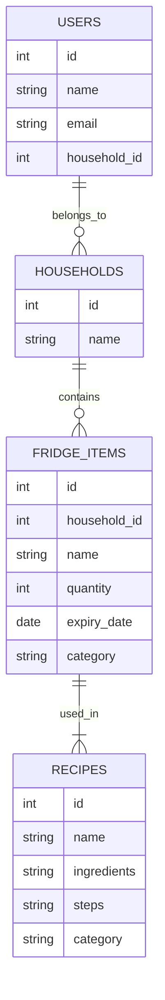

# Project Title

**Fridge-Ventory**

## Overview

Fridge-Ventory is a web application that helps users manage their food inventory, track expiry dates, and discover recipes based on available ingredients. The app aims to reduce food waste, simplify meal planning, and make grocery shopping more efficient through gamified recipe selection and meal prep suggestions.

### Problem Space

Many individuals struggle with keeping track of their groceries, often resulting in food waste. Additionally, meal planning can be a tedious task, especially when trying to cook with existing ingredients. Fridge-Ventory addresses these issues by offering a digital solution to inventory management and meal planning, with engaging features to make the process enjoyable.

### User Profile

- **Primary Users:** Individuals and households who want to manage their groceries efficiently.
- **Use Cases:**
  - Users can add food items as they purchase them.
  - The app will notify users about soon-to-expire items.
  - Users can explore recipes based on their available ingredients.
  - Meal planning features assist in weekly meal prep and grocery shopping.
  - Gamification elements make meal selection fun.
  - Future versions will support shared fridges for multiple household members.

## Features

### Core Features

- **Fridge Management**: Users can add, edit, and remove food items in their fridge.
- **Expiry Tracking**: The app highlights items close to expiry.
- **Recipe Suggestions**: The app suggests recipes based on available ingredients, assuming basic pantry staples.
- **Meal Planning**: Users can plan weekly menus and generate grocery lists.
- **Gamified Recipe Selection**: Interactive and fun ways to choose meals, like a recipe roulette.

## Implementation

### Tech Stack

- **Frontend:** React, Sass, Axios
- **Backend:** Node.js, Express
- **Database:** MySQL
- **APIs:**
  - **Spoonacular API** (for recipe suggestions based on available ingredients)
  - **Google Cloud Vision API** (for receipt scanning to automate grocery entry)

### APIs

- **Spoonacular API**: Used to fetch recipe ideas based on ingredients in the user's fridge.
- **Google Cloud Vision API** (Post MVP): Used to extract text from grocery receipts and auto-add food items.
- **Custom-built API** for fridge management and meal planning.

### Sitemap

- **Home:** Overview of fridge inventory and expiry alerts.
- **Recipes:** Suggested meals based on current ingredients.
- **Meal Planner:** Weekly meal planning and grocery list generator.
- **Settings:** User preferences and household sharing options.

### Data Structure

#### Tables:

- **Users** (id, name, email, household_id)
- **Households** (id, name)
- **Fridge_Items** (id, household_id, name, quantity, expiry_date, category)
- **Recipes** (id, name, ingredients, steps, category)

#### Tables (continued)

**Users**

- `id` (Primary Key)
- `name` (User's name)
- `email` (User's email)
- `household_id` (Foreign Key referencing `Households`)

**Households**

- `id` (Primary Key)
- `name` (Household name or identifier)

**Fridge_Items**

- `id` (Primary Key)
- `household_id` (Foreign Key referencing `Households`)
- `name` (Item name, e.g., "Milk")
- `quantity` (Amount of the item)
- `expiry_date` (Expiration date of the item)
- `category` (E.g., dairy, meat, vegetables)

**Recipes**

- `id` (Primary Key)
- `name` (Recipe name, e.g., "Pasta Carbonara")
- `ingredients` (List of required ingredients)
- `steps` (Cooking instructions)
- `category` (E.g., breakfast, lunch, dinner)

#### Relationships Between Tables

**Users → Households**:

- Each **User** belongs to **one Household**.
- A **Household** can have multiple **Users**.

**Households → Fridge_Items**:

- Each **Household** has **many Fridge_Items**.
- Each **Fridge_Item** belongs to **one Household**.

**Fridge_Items → Recipes**:

- Recipes **use Fridge Items** as ingredients.
- The connection between Fridge Items and Recipes can be managed **either dynamically (via API queries) or a junction table (Post-MVP consideration)**.

#### Visual



### Endpoints

- **GET /fridge** - Retrieve a user’s fridge items.
- **POST /fridge** - Add an item to the fridge.
- **PUT /fridge/:id** - Update an item.
- **DELETE /fridge/:id** - Remove an item.
- **GET /recipes** - Fetch recipe suggestions using the Spoonacular API.
- **POST /meal-plan** - Create a weekly meal plan.
- **POST /upload-receipt** (Post MVP) - Extract grocery items from a receipt using Google Cloud Vision API.

## Roadmap

- **Week 1:**
  - Project setup, database schema design, and basic CRUD for fridge items.
  - Implement recipe suggestions using Spoonacular API and meal planner.
- **Week 2:**
  - Gamification features for recipe selection.
  - UI refinement, bug fixes, and final presentation.

## Future Implementations / Post-MVP

- Integrate Google Cloud Vision API for receipt parsing.
- Enhance with AI-based recipe generation.
- Expand receipt scanning feature with OCR.
- Enable household-sharing functionalities.

### Nice-to-Have Features (Post MVP)

- **Receipt Parsing**: Users can upload a receipt image, and the app will extract purchased food items using OCR.
- **Household Sharing**: Users can invite others to share a fridge, vote on meals, and track contributions.
- **AI-Powered Recipe Suggestions**: The app can suggest meals based on moods or preferences.

```

```
